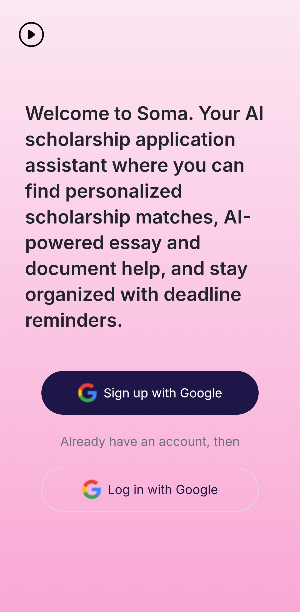
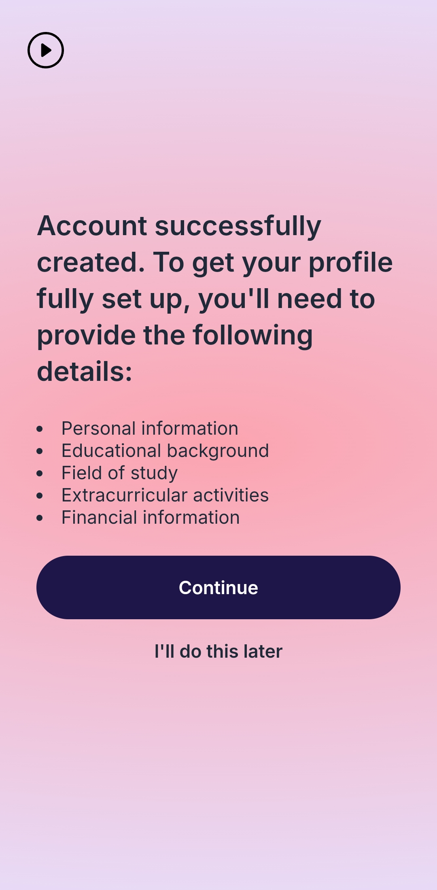
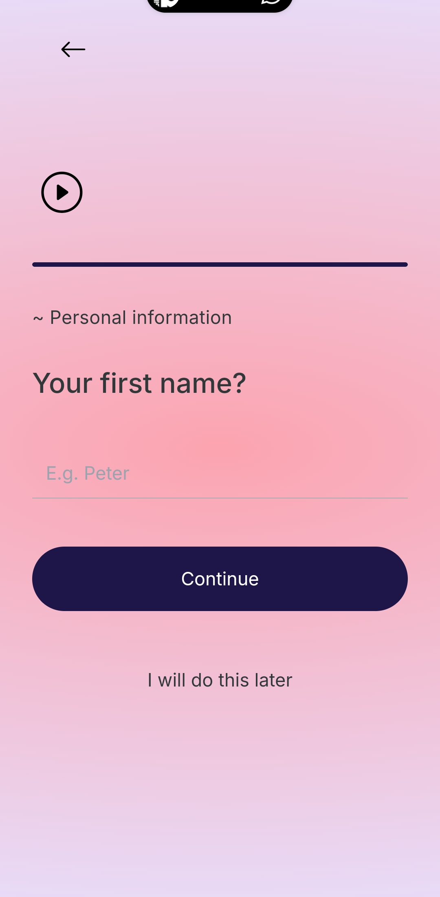
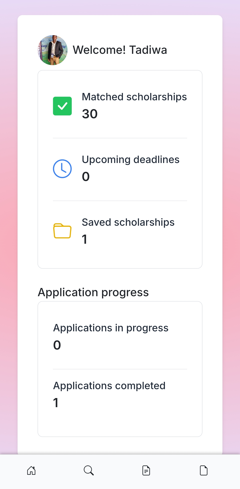
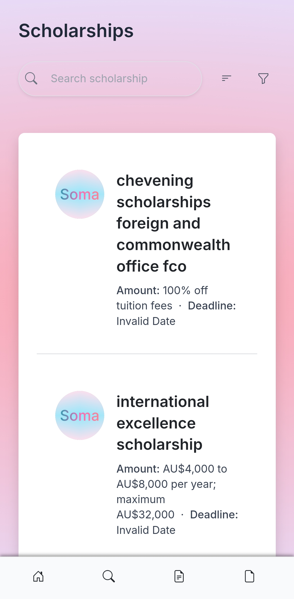
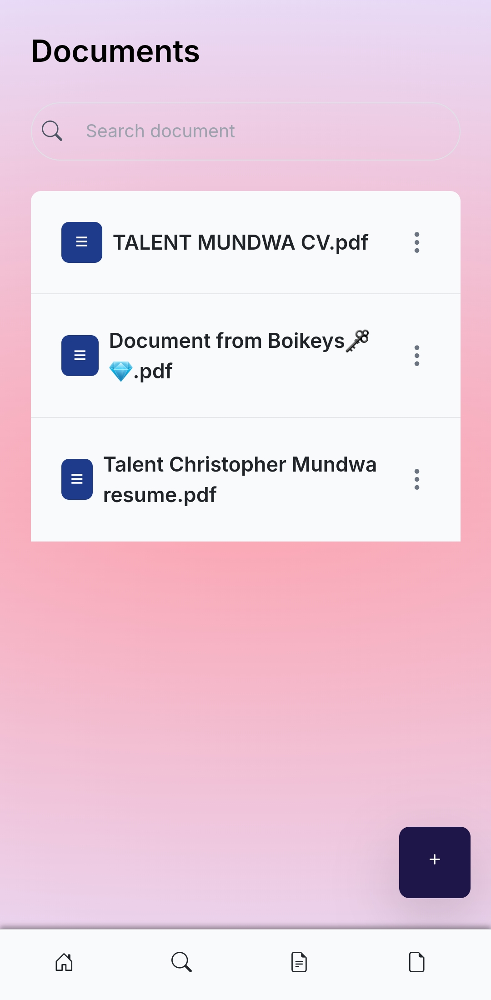
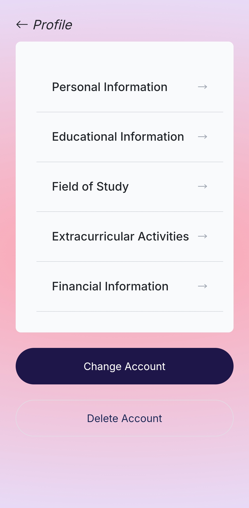

# Soma AI - Scholarship Application Assistant

Welcome to the Soma AI GitHub repository! Soma AI is an AI-powered scholarship application assistant designed to help students find and apply for scholarships that fit their profiles. This repository contains the source code and development history of the Soma AI platform.

## Table of Contents
1. [Overview](#overview)
2. [Recommended Browsers](#recommended-browsers)
3. [Features](#features)
4. [Screenshots](#screenshots)
5. [Structure](#structure)
6. [How AI Models Are Solving the Problem](#how-ai-models-are-solving-the-problem)
7. [How It Works](#how-it-works)
    - [Main Dashboard](#main-dashboard)
    - [Scholarship Search and Listing](#scholarship-search-and-listing)
    - [Document Management](#document-management)
    - [Profile Management](#profile-management)
    - [Navigation](#navigation)
8. [Getting Started](#getting-started)
9. [Technologies Used](#technologies-used)
10. [Privacy and Security](#privacy-and-security)
11. [Support](#support)
12. [About Us](#about-us)
13. [Feedback](#feedback)
14. [Updates and Improvements](#updates-and-improvements)
15. [Accessibility](#accessibility)
16. [Contributing](#contributing)
17. [License](#license)

## Overview
Soma AI is an innovative, web-based application designed to streamline the scholarship application process for students. By leveraging artificial intelligence, Soma AI provides personalized scholarship matches, offers intelligent assistance with application materials, and helps students manage their scholarship journey efficiently.

## Recommended Browsers
For the best experience, we recommend using Soma AI on one of the following web browsers:
- Google Chrome
- Safari
- Firefox

## Features
- Personalized scholarship matches
- AI-powered essay and document assistance
- Deadline reminders and application tracking
- Google account integration for easy sign-up and login
- Comprehensive user profile management
- Document creation and management system
- Detailed scholarship search and listing

## Screenshots

### Onboarding Screen

  
*Description*: Add an image showing the initial welcome or onboarding screen of the application, giving users an overview of Soma AI's features.

### Sign Up With Google

  
*Description*: Insert a screenshot of the Google sign-up page to show how users can quickly register with their Google account.

### Account Successfully Created

  
*Description*: Include an image of the confirmation screen that appears after successfully creating an account, highlighting key details to complete the user profile.

### Personal Information Form

  
*Description*: Show a screenshot of the form where users enter personal information. This image demonstrates the profile setup process.

## Structure
The repository is structured as follows:

- **`frontend/`**: Houses the frontend code, developed using JavaScript, React, and Tailwind CSS.
- **`firebase/`**: Contains Firebase configuration files and cloud functions for backend services, including user authentication, Firestore database operations, and cloud storage.
- **`azure/`**: Stores the scripts and configuration files for deploying the AI models on Azure.

## How AI Models Are Solving the Problem
Soma AI leverages advanced AI models hosted on Microsoft Azure for:
- **Personalized Scholarship Matching**: Analyzes user profiles to find the most relevant scholarships and learns from user interactions to enhance matching over time.
- **AI-Powered Writing Assistance**: Assists in drafting and editing documents like personal statements and essays, ensuring clarity and alignment with scholarship requirements.

## How It Works

### Main Dashboard


After logging in, you'll see a personalized dashboard that includes:
- Welcome message with your name
- Number of matched scholarships
- Upcoming application deadlines
- Saved scholarships count
- Application progress (in progress and completed)

### Scholarship Search and Listing


The search interface allows users to filter scholarships by criteria such as location, field of study, and award
- Search bar for finding specific scholarships
- Filter options to refine search results
- Scholarship cards showing name, amount, and deadline
- Detailed information for each scholarship, including eligibility criteria

### Document Management

- Create, store, and manage all scholarship-related documents
- Search functionality for quick document retrieval
- AI-powered assistance for drafting and editing essays

### Profile Management

The Profile section allows users to manage their personal and academic information, including personal details, educational background, field of study, extracurricular activities, and financial information. Additional account management options include switching or deleting accounts.

### Navigation
The web application features an intuitive navigation menu for easy access to all features.

## Getting Started
1. Clone the repository:
    ```bash
    git clone https://github.com/your-username/soma.git
    cd soma
    ```
2. Install the necessary dependencies for the frontend:
    ```bash
    # For the frontend
    cd frontend
    npm install
    ```
3. Set up your Firebase project:
    - Create a Firebase project at [Firebase Console](https://console.firebase.google.com/).
    - Enable Firebase Authentication, Firestore Database, and Cloud Storage in your Firebase project.
    - Download the `firebaseConfig` object from your project settings and place it in the `frontend/src/firebase` directory.

4. Set up Azure for AI models:
    - Deploy the AI models to your Azure account.
    - Obtain the necessary API endpoints and keys from your Azure resources.
    - Update the `frontend/src/config.js` file with the Azure endpoint URLs and API keys.

5. Set up your environment variables:
    ```bash
    # Create a .env file in the frontend directory and add your Firebase and Azure credentials
    REACT_APP_FIREBASE_API_KEY=your-firebase-api-key
    REACT_APP_FIREBASE_AUTH_DOMAIN=your-firebase-auth-domain
    REACT_APP_AZURE_AI_ENDPOINT=your-azure-ai-endpoint
    REACT_APP_AZURE_API_KEY=your-azure-api-key
    ```
6. Start the frontend development server:
    ```bash
    cd frontend
    npm start
    ```

## Technologies Used
- **Frontend**: React, Tailwind CSS
- **Backend**: Firebase (Authentication, Firestore Database, Cloud Storage)
- **AI/ML**: Azure Machine Learning for hosting and running AI models
- **Authentication**: Firebase with Google OAuth integration

## Privacy and Security
- Uses Firebase for secure authentication and data storage.
- Personal information is encrypted and securely stored in Firestore.
- AI models are hosted on Azure with strict security protocols.
- Users can update or delete their data at any time.
- Information is used solely for scholarship matching and application assistance.

## Support
Feel free to reach out to us at [email@example.com](Talent:talentmundwa5@gmail.com) or join our [community chat](https://discord.gg/YourCommunityLink).

## About Us
we are African students who have a mission to make a change when it comes to look for scholaships

## Feedback
We value your input! If you have any suggestions or encounter any issues, please [contact information to be added].

## Updates and Improvements
We are constantly working to improve Soma AI and add new features. Check our website regularly for the latest improvements and scholarship opportunities.

## Accessibility
Soma AI is committed to providing an accessible experience for all users. If you encounter any accessibility issues, please contact our support team.

## Contributing
We welcome contributions to Soma AI! If you have any suggestions or improvements, feel free to open an issue or submit a pull request.

## License
Soma AI is licensed under the MIT License. Please refer to the [LICENSE](LICENSE) file for more information.

---

This project was created for a hackathon and is under active development. We appreciate your feedback and support!